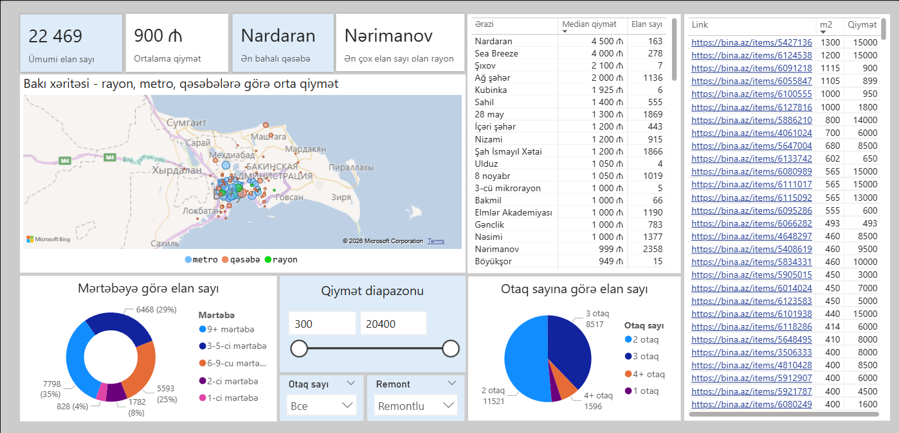

# 🏠 Bakıda aylıq kirayə üzrə Dashboard — 2026
 
> Bakıda mənzil kirayəsi bazarının bina.az-dan alınan real məlumatlar əsasında analizi
 

 
---
 
## 📊 Layihə haqqında
 
Bakıda mənzil kirayəsi bazarını analiz etmək üçün interaktiv Power BI dashboard. Layihə Data Analytics öyrənmə prosesində real məlumatlarla işləmək məqsədilə hazırlanıb.
 
**Məlumat mənbəyi:** bina.az — Azərbaycanın ən böyük daşınmaz əmlak saytı  
**Dövr:** Aprel–May 2026 (məlumatlar statik şəkildə 16 mayda yüklənib) 
**Elan sayı:** 22 469 (16 may)
 
---
 
## 🔍 Əsas nəticələr
 
- 💰 **Ortalama kirayə qiyməti** — 900 AZN/ay
- 🏘️ **Ən bahalı rayon** — Nardaran (median 4 500 AZN, 163 elan)
- 📍 **Ən çox elan olan rayon** — Nərimanov (2 358 elan)
- 🛏️ **Ən çox yayılmış** — 2 otaqlı mənzillər (11 521 elan, 51%)
- 🏢 **Ən çox elan** — 9-dan yuxarı mərtəbə (6 468 elan, 29%)
- 🗺️ **Rayon tipləri:** metro, qəsəbə, rayon
---
 
## 📈 Dashboard nələri əhatə edir
 
- **KPI kartları** — ümumi elan sayı, ortalama qiymət, ən bahalı qəsəbə, ən çox elan olan rayon
- **Bakı xəritəsi** — rayonlar üzrə orta qiymət (metro / qəsəbə / rayon)
- **Rayonlar cədvəli** — median qiymət və elan sayı ilə rayonlar
- **Mərtəbəyə görə elan sayı** — hansı mərtəbələrdə daha çox elan var
- **Otaq sayına görə elan sayı** — 1/2/3/4+ otaq paylanması
- **Qiymət diapazonu** — interaktiv filtr (300 – 20 400 AZN)
- **Otaq sayı və remont filtri** — istifadəçi üçün interaktiv seçim
- **Keçid linkləri** — hər elanın bina.az səhifəsinə birbaşa link, m2 və qiyməti
---
 
## 🛠️ İstifadə olunan alətlər
 
| Alət | İstifadə |
|---|---|
| **Power BI Desktop** | Vizuallaşdırma və dashboard |
| **DAX** | Ölçülər və hesablanmış sütunlar |
| **Power Query (M)** | Məlumatların təmizlənməsi və transformasiyası |
| **Python (pandas)** | İlkin məlumat analizi |
| **Excel (.xlsx)** | Məlumat mənbəyi |
 
---
 
## 📁 Layihənin strukturu
 
```
📦 baku-rent-dashboard
 ┣ 📊 binaaz_dashboard.pbix    — Power BI faylı
 ┣ 📂 baku_rent_final.xlsx     — dataset
 ┣ 🖼️ dashboard_preview.png   — dashboard skrinşotu
 ┗ 📄 README.md
```

 
## 👨‍💻 Müəllif
 
Layihə Data Analytics öyrənmə prosesində hazırlanıb.  
Rəy və tövsiyələrə çox şadam!

 
